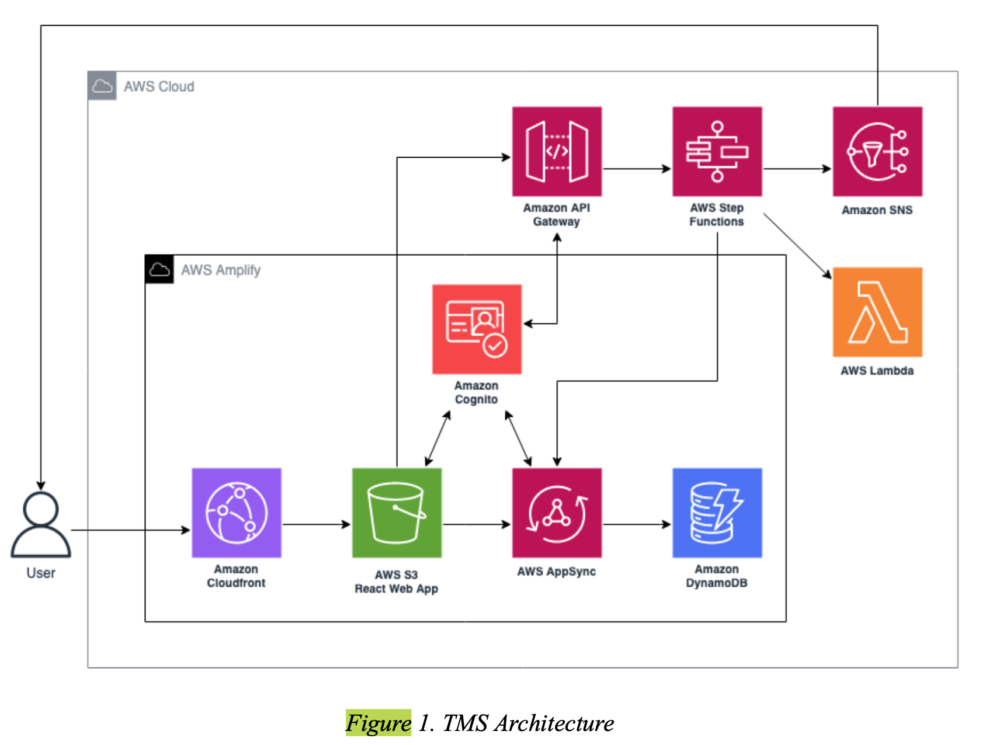

# Tournament Management System (TMS)

## Team

- **Bryan Kwong**
- **Fuyu Zhang**
- **Patrick Daniel Bustos**
- **Rohan Patel**

Each team member has played a pivotal role in the development and success of TMS, contributing their unique skills and expertise to create a comprehensive tournament management system.

## Table of Contents

- [Team](#team)
- [Introduction](#introduction)
- [Features](#features)
- [Architecture](#architecture)
  - [Architecture Diagram](#architecture-diagram)
  - [Architectural Overview](#architectural-overview)
- [Tech Stack](#tech-stack)
- [Demo](#demo)
- [Getting Started](#getting-started)
  - [Prerequisites](#prerequisites)
  - [Installation](#installation)
  - [Configuration](#configuration)
- [Available Scripts](#available-scripts)
- [Project Structure](#project-structure)
- [Dependencies](#dependencies)
- [CI/CD Pipeline](#cicd-pipeline)
- [Testing](#testing)
- [Code Quality](#code-quality)
- [Security](#security)
  - [Authentication & Authorization](#authentication--authorization)
  - [Data Protection](#data-protection)
  - [Dependency Management](#dependency-management)
- [Deployment](#deployment)
- [Contributing](#contributing)
- [Acknowledgements](#acknowledgements)

## Introduction

**TMS** is a cutting-edge web application designed to streamline tournament management. Leveraging the power of **React** for the frontend and **AWS Amplify** for the backend, TMS offers a robust, scalable, and secure platform for organizing and managing various tournament formats, states, and venues.

Whether you're organizing a local speech and debate tournament or a large-scale competitive tournament, TMS provides the tools you need to manage competitors, judges, venues, and event formats seamlessly.

## Features

- **Automated Competitor Enrollment**: Streamline the process of registering and managing competitors.
- **User Roles and Permissions**: Different access levels for organizers, competitors, and judges.
- **Dynamic Bracket Assignment**: Automatically create and assign competition brackets based on predefined formats.
- **Judging and Scoring Integration**: Collect and tabulate judges’ decisions seamlessly.
- **Real-time Tournament Tracking**: Monitor the progress of tournaments in real-time with up-to-date information.
- **Venue Handling**: Manage multiple venues, rooms, and associated details.

## Architecture

### Architecture Diagram



*High-level architecture of the Tournament Management System.*

### Architectural Overview

TMS leverages a serverless architecture using AWS services to ensure scalability, reliability, and cost-efficiency. The core components include:

- **Frontend**: Built with React, utilizing React Bootstrap for responsive design and Redux Toolkit for state management.
- **Backend**: Managed through AWS Amplify, which integrates with services like AWS AppSync for GraphQL APIs, AWS Lambda for serverless functions, and AWS Cognito for authentication.
- **Database**: AWS DynamoDB serves as the primary database, offering fast and flexible NoSQL data storage.
- **CI/CD**: GitHub Actions automates the build, test, and deployment processes, ensuring continuous integration and delivery.

## Tech Stack

- **Frontend**:
  - [React](https://reactjs.org/)
  - [React Bootstrap](https://react-bootstrap.github.io/)
  - [Redux Toolkit](https://redux-toolkit.js.org/)
  - [React Router](https://reactrouter.com/)
  - [AWS Amplify UI React](https://ui.docs.amplify.aws/react)
  - [Day.js](https://day.js.org/)

- **Backend**:
  - [AWS Amplify](https://aws.amazon.com/amplify/)
  - [AWS AppSync](https://aws.amazon.com/appsync/)
  - [AWS Cognito](https://aws.amazon.com/cognito/)
  - [GraphQL](https://graphql.org/)

- **DevOps**:
  - [GitHub Actions](https://github.com/features/actions)
  - [ESLint](https://eslint.org/)
  - [Prettier](https://prettier.io/)
  
- **Others**:
  - [Bootstrap](https://getbootstrap.com/)
  - [Sass](https://sass-lang.com/)

- **Automated CI/CD**: Integrated GitHub Actions workflows for continuous integration and deployment.
- **Code Quality Tools**: Enforced code quality with ESLint and Prettier.
- **Dynamic Tournament Management**: Create and update various tournament formats and states with ease.
- **Real-time Data Operations**: Utilize AWS AppSync and DataStore for real-time data querying and mutations.
- **Responsive Design**: Built with React Bootstrap for a responsive and intuitive user interface.
- **Robust Validation**: Comprehensive form validation to ensure data integrity.
- **Scalable Architecture**: Designed to handle tournaments of any size with high efficiency.
- **Secure and Reliable**: Built on AWS Amplify, ensuring data security and reliability.
- **State Management**: Efficient state management using Redux Toolkit.
- **User Authentication**: Secure user authentication using AWS Cognito with support for API Key and IAM.

## Demo


*Screenshot showcasing the TMS dashboard and tournament management interface.*

## Getting Started

Follow these instructions to set up and run the project locally.

### Prerequisites

Ensure you have the following installed on your machine:

- **Node.js** (v16.x or later)
- **Yarn** or **npm** (v6.x or later)
- **AWS CLI** configured with appropriate permissions
- **Amplify CLI** (`npm install -g @aws-amplify/cli`)

### Installation

1. **Clone the Repository**

   ```bash
   git clone https://github.com/Tournament-Management-System/webapp.git
   cd webapp
   ```

2. **Install Dependencies**

   Using Yarn:

   ```bash
   yarn install
   ```

   Or using npm:

   ```bash
   npm install
   ```

3. **Initialize AWS Amplify**

   ```bash
   amplify init
   ```

   Follow the prompts to configure your Amplify project. Ensure you select the correct environment (e.g., `dev`, `staging`, `prod`).

4. **Push Backend Configurations**

   ```bash
   amplify push
   ```

   This command provisions the backend resources defined in the `amplify` directory.

### Configuration

1. **Environment Variables**

   Create a `.env` file in the root directory and add any necessary environment variables. Ensure sensitive information is kept secure and not committed to the repository.

   ```env
   REACT_APP_API_KEY=your-api-key
   REACT_APP_AWS_REGION=us-east-1
   # Add other environment variables as needed
   ```

2. **AWS Amplify Configuration**

   The Amplify configuration files are located in `src/aws-exports.js`. Ensure this file is correctly generated and updated after running `amplify push`.

## Available Scripts

In the project directory, you can run:

### `yarn start` or `npm start`

Runs the app in development mode.  
Open [http://localhost:3000](http://localhost:3000) to view it in the browser.

### `yarn build` or `npm run build`

Builds the app for production to the `build` folder.  
It correctly bundles React in production mode and optimizes the build for the best performance.

### `yarn test` or `npm test`

Launches the test runner in interactive watch mode.

### `yarn eject` or `npm run eject`

**Note: this is a one-way operation. Once you `eject`, you can’t go back!**

Ejects the Create React App configuration.  
Use this only if you need to customize the build configuration.

### `yarn lint`

Runs Prettier in check mode on the `src` directory to enforce code formatting standards.

## Project Structure

```
.
├── .github/
│   └── workflows/
│       └── node.js.yml          # GitHub Actions workflow for CI
├── amplify/
│   ├── .config/
│   │   └── project-config.json   # Amplify project configuration
│   ├── backend/
│   │   ├── api/
│   │   │   └── Teems/
│   │   │       ├── resolvers/
│   │   │       │   └── README.md    # Documentation for custom resolvers
│   │   │       ├── stacks/
│   │   │       │   └── CustomResources.json
│   │   │       ├── cli-inputs.json
│   │   │       ├── parameters.json
│   │   │       ├── schema.graphql
│   │   │       └── transform.conf.json
│   │   ├── auth/
│   │   │   └── Teems/
│   │   │       └── cli-inputs.json
│   │   ├── types/
│   │   │   └── amplify-dependent-resources-ref.d.ts
│   │   ├── backend-config.json
│   │   └── tags.json
│   ├── hooks/
│   │   └── README.md            # Documentation for Amplify CLI command hooks
│   ├── cli.json
│   ├── README.md                # Overview and resources for Amplify CLI
│   └── team-provider-info.json   # Environment-specific Amplify configurations
├── public/
│   ├── favicon.ico
│   ├── index.html
│   ├── logo192.png
│   ├── logo512.png
│   ├── manifest.json
│   └── robots.txt
├── src/
│   ├── aws-exports.js            # Amplify configuration for the frontend
│   ├── components/               # Reusable React components
│   ├── models/                   # Data models generated by Amplify
│   ├── pages/                    # Page components for routing
│   ├── redux/                    # Redux Toolkit slices and store
│   ├── ui-components/            # UI components generated by Amplify Studio
│   └── App.js                    # Main application component
├── .eslintignore
├── .gitignore
├── .prettierignore
├── .prettierrc
├── package.json
└── README.md
```

---

## Dependencies

The project uses the following dependencies and devDependencies:

### Core Dependencies:
- **React**: `^18.2.0`
- **Redux Toolkit**: `^1.9.3`
- **AWS Amplify**: `^5.1.3`
- **React Router DOM**: `^6.8.1`
- **React Bootstrap**: `^2.7.1`
- **Day.js**: `^1.11.7`
- **Sass**: `^1.58.0`
- **Bootstrap**: `^5.2.3`

### Development Dependencies:
- **Prettier**: `^2.8.4`
- **ESLint**: Configured through `react-app`
- **React Testing Library**: For unit testing components (`@testing-library/react`, `@testing-library/jest-dom`, `@testing-library/user-event`)

---

## CI/CD Pipeline

### GitHub Actions

The project utilizes **GitHub Actions** for continuous integration, ensuring code quality and reliability through automated workflows.

The **GitHub Actions** workflow ensures that every push or pull request to the `main` or `dev` branches triggers automated processes including:

- **Workflow Configuration**: Located at `.github/workflows/node.js.yml`.
- **Key Steps**:
  1. **Checkout Code**: Uses `actions/checkout@v3` to clone the repository.
  2. **Setup Node.js**: Configures the specified Node.js version (`19.x`).
  3. **Install Dependencies**: Runs `yarn install --frozen-lock` to install dependencies based on the lock file.
  4. **Linting**: Executes `yarn lint` to enforce code formatting standards.
  5. **Testing**: Runs `yarn test` to execute the test suite.

## Testing

Testing and verification are critical to ensure the software functions as intended and meets all requirements.

### Testing Strategy

- **Unit Testing**: Individual components and functions are tested to ensure they work correctly in isolation.
- **Integration Testing**: Tests the interaction between different components and services to ensure they work together seamlessly.
- **End-to-End (E2E) Testing**: Simulates real user scenarios to verify the application's functionality from start to finish.
- **Acceptance Testing**: Ensures the application meets the business requirements and user needs.
- **Peer Reviews and Code Inspections**: Regular code reviews to maintain code quality and consistency.

### Running Tests

Execute the test suite using:

```bash
yarn test
```

Or with npm:

```bash
npm test
```

### Testing Tools

- **Jest**: Used for running unit and integration tests.
- **React Testing Library**: Facilitates testing of React components in a user-centric manner.

### Code Coverage

To generate a code coverage report:

```bash
yarn test --coverage
```

The coverage report will be available in the `coverage` directory.

## Code Quality

Maintaining high code quality is paramount. The project integrates several tools to enforce best practices.

### Linting

- **ESLint**: Analyzes code to quickly find problems.

  **Run Linter**:

  ```bash
  yarn lint
  ```

### Formatting

- **Prettier**: Enforces a consistent code style.

  **Check Formatting**:

  ```bash
  yarn prettier -c src
  ```

  **Auto-format Code**:

  Configure your editor to format on save or run:

  ```bash
  yarn prettier --write src
  ```

### Pre-commit Hooks (Optional)

To ensure that code is linted and formatted before commits, integrate **Husky** and **lint-staged** (optional).

1. **Install Dependencies**

   ```bash
   yarn add husky lint-staged --dev
   ```

2. **Initialize Husky**

   ```bash
   npx husky install
   ```

3. **Add Pre-commit Hook**

   ```bash
   npx husky add .husky/pre-commit "yarn lint && yarn prettier --check src"
   ```

4. **Configure lint-staged** in `package.json`:

   ```json
   "lint-staged": {
     "src/**/*.{js,jsx,ts,tsx}": [
       "prettier --write",
       "eslint --fix",
       "git add"
     ]
   }
   ```

## Security

Ensuring the security of the application and its users is a top priority.

### Authentication & Authorization

- **AWS Cognito**: Manages user authentication with secure handling of user credentials.
- **@auth Directives**: GraphQL schema utilizes `@auth` directives to enforce access controls.

### Data Protection

- **Encryption**: Data stored in AWS services is encrypted at rest and in transit.
- **API Keys**: Managed securely with expiration policies to prevent unauthorized access.

### Dependency Management

- Regularly update dependencies to incorporate security patches.
- Utilize tools like **Dependabot** to automate dependency updates and vulnerability alerts.

### Security Audits

Conduct periodic security reviews and audits to identify and mitigate potential vulnerabilities.

## Deployment

### AWS Amplify Hosting

Deployment of the frontend web app is managed automatically by Amplify Deploy. Amplify handles hosting, build, and deployment processes, ensuring that the latest code changes are reflected in the live application seamlessly.

### Monitoring and Operations

- **AWS CloudWatch**: Utilized for monitoring application performance and capturing logs. CloudWatch alerts notify the team of any errors or anomalies in real-time.

## Contributing

Contributions are what make the open-source community such an amazing place to learn, inspire, and create. Any contributions you make are **greatly appreciated**.

### How to Contribute

1. **Fork the Repository**

   Click the **Fork** button at the top right corner of the repository page to create your own fork.

2. **Clone Your Fork**

   ```bash
   git clone https://github.com/Tournament-Management-System/webapp.git
   cd webapp
   ```

3. **Create a Branch**

   ```bash
   git checkout -b feature/your-feature-name
   ```

4. **Make Changes**

   Implement your feature or bug fix. Ensure that your code adheres to the project's coding standards and passes all tests.

5. **Commit Your Changes**

   ```bash
   git add .
   git commit -m "Add your detailed commit message"
   ```

6. **Push to Your Fork**

   ```bash
   git push origin feature/your-feature-name
   ```

7. **Create a Pull Request**

   Navigate to the original repository and click **New Pull Request**. Provide a clear description of your changes and submit the pull request.

## Acknowledgements

We would like to express our gratitude to:

- **Seshadri Srinivasan** for his invaluable guidance and support as our project advisor.
- **Dan Harkey**, Director of MS Software Engineering, for his oversight and leadership.
- Our classmates and friends who provided feedback and assistance during the development of this project.
- Our families for their unwavering encouragement and support.
- **Kevin Tong** for sharing his expertise on the manual orchestration of tournaments.

Your contributions have been instrumental in the success of our project.

- [AWS Amplify](https://aws.amazon.com/amplify/)
- [AWS Amplify DataStore](https://docs.amplify.aws/lib/datastore/getting-started/q/platform/js/)
- [AWS AppSync](https://aws.amazon.com/appsync/)
- [AWS API Gateway](https://aws.amazon.com/api-gateway/)
- [AWS Cognito](https://aws.amazon.com/cognito/)
- [AWS CloudFront](https://aws.amazon.com/cloudfront/)
- [AWS DynamoDB](https://aws.amazon.com/dynamodb/)
- [AWS IAM](https://aws.amazon.com/iam/)
- [AWS Lambda](https://aws.amazon.com/lambda/)
- [AWS S3](https://aws.amazon.com/s3/)
- [React](https://reactjs.org/)
- [Redux Toolkit](https://redux-toolkit.js.org/)
- [Create React App](https://create-react-app.dev/)
- [GitHub Actions](https://github.com/features/actions)
- [ESLint](https://eslint.org/)
- [Prettier](https://prettier.io/)
- [Bootstrap](https://getbootstrap.com/)
- [Jest](https://jestjs.io/)
- [React Testing Library](https://testing-library.com/docs/react-testing-library/intro/)
- [Husky](https://typicode.github.io/husky/#/)
- [lint-staged](https://github.com/okonet/lint-staged)
- [GraphQL](https://graphql.org/)

---

© 2023 Bryan Kwong, Fuyu Zhang, Patrick Daniel Bustos, Rohan Patel. All rights reserved.

---
